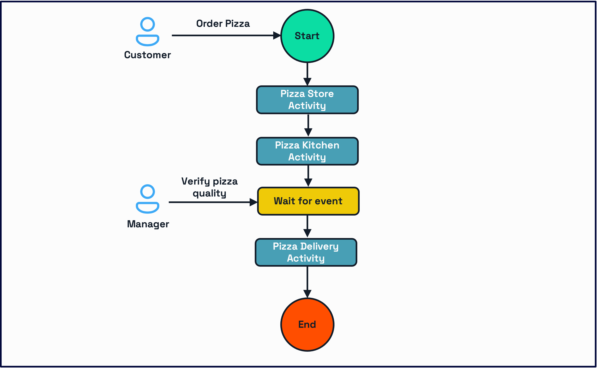

# Aspire - Challenge 5 - Workflow - Pub/Sub
## Introduction

This challenge builds on top of Aspire - Challenge 4 (Workflow) - [Link](../challenge-4/aspire.md):

- Aspire .NET is used to compose the services. Also Aspire -NET substitutes Dapr component files.
- Communication between the Workflow service and the microservices is changed from "Invocation" to "Pub/Sub".


## Prepare
### Setup codebase
- Navigate to the `before/09-aspire-challenge-4` folder 


## The Challenge

### Recap

In challenge 4 you implemented the pizza workflow illustrated below




Your implementation used "Invocation" to send commands from the workflow activities to the services doing the job - as illustrated below 


### The challenge - Asynchronous Request-Reply pattern

The challenge is to go from a  synchronous Request-Reply pattern using "invocation" to an Asynchronous Request-Reply pattern using "pubsub" as communication platform between the workflow and the services doing the job. This requires the introduction of a total different communication schema. 

#### The consequence of using a message broker

First of all you need a message broker to facilitate the communication - in this challenge we will use Redis as our Pub/Sub message broker. 

Secondly you need to do a messaging design where you define topics and messages.

#### Application redesign
Then you need to change the behavior of the workflow due to the fact that we are changing form a REST based request/response schema to a message broker based request/response schema. 

The consequence is that the workflow activities change from calling a service using invocation to calling a service by sending a publish to the message broker. 
This change means that we no longer will get a response from the service in the activity. Instead we need to wait for a reply in the "reply message channel". 

To implement this we will need to change the workflow - after every activity we need to wait for an external event using a `WaitForExternalEventAsync`. Also we need to setup a controller that will receive the incoming messages and issue a `RaiseWorkflowEventAsync`.

## Message broker design

The new design is illustrated below


### Message design

The topics and messages are shown in the following table

| Topic               | Message        | Publisher          | Subscriber         | Comment                   |
| ------------------- | -------------- | ------------------ | ------------------ | ------------------------- |
| storefront          | order          | Workflow service   | Storefront service | `OrderMessage.cs`         |
| kitchen             | cook           | Workflow service   | Kitchen service    | `CookMessage.cs`          |
| delivery            | deliver        | Workflow service   | Delivery service   | `DeliverMessage.cs`       |
| workflow-storefront | order-result   | Storefront service | Workflow service   | `OrderResultMessage.cs`   |
| workflow-kitchen    | cook-result    | Kitchen service    | Workflow service   | `CookResultMessage.cs`    |
| workflow-delivery   | deliver-result | Delivery service   | Workflow service   | `DeliverResultMessage.cs` |
|                     |                |                    |                    |                           |
|                     |                |                    |                    |                           |

**Since all messages correlates to a given workflow, all messages must contain the correlated workflow id. Therefore we introduce a superclass  `WorkflowMessage.cs` that all concrete messages must implement.**


## Application changes


### Shared message library

Since the messages are cross microservice and all services are written in .NET and C#, it make sense to make a shared library with the messages (and some global parameters)

#### Add a library to the solution
Add a new a new class library project called `PizzaShared` to the solution.

#### Superclass

Add a new folder to the called `Messages` to the solution

Add a new class `WorkflowMessage` in the `Messages` folder

```c#
namespace PizzaShared.Messages;

public abstract class WorkflowMessage
{
    public string WorkflowId { get; set; }
}

public class CustomerDto
{
    public required string Name { get; set; }
    public required string Address { get; set; }
    public required string Phone { get; set; }
}
```


#### StorFront messages

Add a new sub folder to  `Messages`  the called `StoreFront` to the solution

Add a new class `OrderMessage` in the `StoreFront` folder

```c#
namespace PizzaShared.Messages.StoreFront;

public class OrderMessage : WorkflowMessage
{
    public string OrderId { get; set; }
    public string PizzaType { get; set; }
    public string Size { get; set; }
    public CustomerDto Customer { get; set; }
}

public class OrderResultMessage : OrderMessage
{
    public string Status { get; set; }
    public string? Error { get; set; }
}
```


#### PizzaKitchen messages
Add a new sub folder to  `Messages`  the called `Kitchen` to the solution
Add a new class `CookMessage` in the `Kitchen` folder

```c#
namespace PizzaShared.Messages.Kitchen;

public class CookMessage : WorkflowMessage
{
    public string OrderId { get; set; }
    public string PizzaType { get; set; }
    public string Size { get; set; }
    public CustomerDto Customer { get; set; }
}

public class CookResultMessage : CookMessage
{
    public string Status { get; set; }
    public string? Error { get; set; }
}
```


#### PizzaDelivery messages
Add a new sub folder to  `Messages`  the called `Delivery` to the solution
Add a new class `DeliverMessage` in the `Delivery` folder

```c#
namespace PizzaShared.Messages.Delivery;

public class DeliverMessage : WorkflowMessage
{
    public string OrderId { get; set; }
    public string PizzaType { get; set; }
    public string Size { get; set; }
    public CustomerDto Customer { get; set; }
}

public class DeliverResultMessage : DeliverMessage
{
    public string Status { get; set; }
    public string? Error { get; set; }
}
```


#### Add shared library to projects

Add a project reference to `PizzaShared` from these projects:

- PizzaDelivery
- PizzaKitchen
- PizzaOrder
- PizzaStorefront
- PizzaWorkflow


### Changes to PizzaStorefront

Delete the `Models` folder at its content

#### Changes to `StorefrontService.cs`

Change the signature of the interface to work with the Message classes.

```c#
public interface IStorefrontService
{
    Task<OrderResultMessage> ProcessOrderAsync(OrderMessage order);
}
```

Change the signature of the implementation to work with the Message classes.

Change the code to work with the Message classes.

```c#
    public async Task<OrderResultMessage> ProcessOrderAsync(OrderMessage orderMessage)
    {
        var stages = new (string status, int duration)[]
        {
            ("validating", 1),
            ("processing", 2),
            ("confirmed", 1)
        };

        var order = new OrderResultMessage
        {
            WorkflowId = orderMessage.WorkflowId,
            OrderId = orderMessage.OrderId,
            PizzaType = orderMessage.PizzaType,
            Size = orderMessage.Size,
            Customer = orderMessage.Customer,
            Status = "unknown"
        };

```


#### Changes to `StorefrontController.cs`

Add DaprClient to the constructor.

```c#
    private readonly DaprClient _daprClient;
    private readonly ILogger<StorefrontController> _logger;
    private readonly IStorefrontService _storefrontService;

    public StorefrontController(IStorefrontService storefrontService, ILogger<StorefrontController> logger,
        DaprClient daprClient)
    {
        _daprClient = daprClient;
        _storefrontService = storefrontService;
        _logger = logger;
    }
```

Change signature of `CreateOrder` from Post to Topic.

Change `CreateOrder` to use `PublishEventAsync`

```c#
    [Topic("pizzapubsub", "storefront")]
    public async Task<IActionResult> CreateOrder(OrderMessage order)
    {
        _logger.LogInformation("Received new order: {OrderId}", order.OrderId);
        var result = await _storefrontService.ProcessOrderAsync(order);

        await _daprClient.PublishEventAsync("pizzapubsub", "workflow-storefront", result);

        return Ok();
    }
```

#### Changes to `Program.cs`

Add `UseCloudEvents` and `MapSubscribeHandler`

```c#


// Dapr will send serialized event object vs. being raw CloudEvent
app.UseCloudEvents();

// needed for Dapr pub/sub routing
app.MapSubscribeHandler();

app.MapControllers();
app.Run();
```


### Changes to PizzaKitchen

Delete the `Models` folder at its content

#### Changes to `CookService.cs`

Change the signature of the interface to work with the Message classes.

```c#
public interface ICookService
{
    Task<CookResultMessage> CookPizzaAsync(CookMessage order);
}
```

Change the signature of the implementation to work with the Message classes.

Change the code to work with the Message classes.

```c#
    public async Task<CookResultMessage> CookPizzaAsync(CookMessage cookMessage)
    {
        var stages = new (string status, int duration)[]
        {
            ("cooking_preparing_ingredients", 2),
            ("cooking_making_dough", 3),
            ("cooking_adding_toppings", 2),
            ("cooking_baking", 5),
            ("cooking_quality_check", 1)
        };

        var order = new CookResultMessage
        {
            WorkflowId = cookMessage.WorkflowId,
            OrderId = cookMessage.OrderId,
            PizzaType = cookMessage.PizzaType,
            Size = cookMessage.Size,
            Customer = cookMessage.Customer,
            Status = "unknown"
        };

```

#### Changes to `CookController.cs`

Add DaprClient to the constructor.

```c#
    private readonly ICookService _cookService;
    private readonly DaprClient _daprClient;
    private readonly ILogger<CookController> _logger;

    public CookController(ICookService cookService, ILogger<CookController> logger, DaprClient daprClient)
    {
        _cookService = cookService;
        _logger = logger;
        _daprClient = daprClient;
    }
```

Change signature of `Cook` from Post to Topic.

Change `Cook` to use `PublishEventAsync`

```c#
    [Topic("pizzapubsub", "kitchen")]
    public async Task<IActionResult> Cook(CookMessage cookMessage)
    {
        _logger.LogInformation("Starting cooking for order: {OrderId}", cookMessage.OrderId);
        var result = await _cookService.CookPizzaAsync(cookMessage);

        await _daprClient.PublishEventAsync("pizzapubsub", "workflow-kitchen", result);

        return Ok();
    }

```

#### Changes to `Program.cs`

Add `UseCloudEvents` and `MapSubscribeHandler`

```c#

// Dapr will send serialized event object vs. being raw CloudEvent
app.UseCloudEvents();

// needed for Dapr pub/sub routing
app.MapSubscribeHandler();

app.MapControllers();
app.Run();
```

### Changes to PizzaDelivery

Delete the `Models` folder at its content

#### Changes to `DeliveryService.cs`

Change the signature of the interface to work with the Message classes.

```c#
public interface IDeliveryService
{
    Task<DeliverResultMessage> DeliverPizzaAsync(DeliverMessage deliverMessage);
}
```

Change the signature of the implementation to work with the Message classes.

Change the code to work with the Message classes.

```c#
    public async Task<DeliverResultMessage> DeliverPizzaAsync(DeliverMessage deliverMessage)
    {
        var stages = new (string status, int duration)[]
        {
            ("delivery_finding_driver", 2),
            ("delivery_driver_assigned", 1),
            ("delivery_picked_up", 2),
            ("delivery_on_the_way", 5),
            ("delivery_arriving", 2),
            ("delivery_at_location", 1)
        };

        var order = new DeliverResultMessage
        {
            WorkflowId = deliverMessage.WorkflowId,
            OrderId = deliverMessage.OrderId,
            PizzaType = deliverMessage.PizzaType,
            Size = deliverMessage.Size,
            Customer = deliverMessage.Customer,
            Status = "unknown"
        };


```

#### Changes to `DeliveryController.cs`

Add DaprClient to the constructor.

```
    private readonly DaprClient _daprClient;
    private readonly IDeliveryService _deliveryService;
    private readonly ILogger<DeliveryController> _logger;

    public DeliveryController(IDeliveryService deliveryService, ILogger<DeliveryController> logger,
        DaprClient daprClient)
    {
        _deliveryService = deliveryService;
        _logger = logger;
        _daprClient = daprClient;
    }
```

Change signature of `Deliver` from Post to Topic.

Change `Deliver` to use `PublishEventAsync`

```c#
    [Topic("pizzapubsub", "delivery")]
    public async Task<IActionResult> Deliver(DeliverMessage deliverMessage)
    {
        _logger.LogInformation("Starting delivery for order: {OrderId}", deliverMessage.OrderId);
        var result = await _deliveryService.DeliverPizzaAsync(deliverMessage);

        await _daprClient.PublishEventAsync("pizzapubsub", "workflow-delivery", result);

        return Ok();
    }
```

#### Changes to `Program.cs`

Add `UseCloudEvents` and `MapSubscribeHandler`

```c#

// Dapr will send serialized event object vs. being raw CloudEvent
app.UseCloudEvents();

// needed for Dapr pub/sub routing
app.MapSubscribeHandler();

app.MapControllers();
app.Run();
```

### Changes to  PizzaOrder

#### Changes to `OrderController.cs`

Change `HandleOrderUpdate` to programmatic pub/sub 

```c#
    [HttpPost("/orders-sub")]
    [Topic("pizzapubsub", "orders")]
    public async Task<IActionResult> HandleOrderUpdate(Order cloudEvent)
    {
        _logger.LogInformation("Received order update for order {OrderId}", 
            cloudEvent.OrderId);

        var result = await _orderStateService.UpdateOrderStateAsync(cloudEvent);
        return Ok();
    }
}
```

#### Changes to `Program.cs`

Add `UseCloudEvents` and `MapSubscribeHandler`

```c#
if (app.Environment.IsDevelopment())
{
    app.UseSwagger();
    app.UseSwaggerUI();
}
// Dapr will send serialized event object vs. being raw CloudEvent
app.UseCloudEvents();

// needed for Dapr pub/sub routing
app.MapSubscribeHandler();

app.MapControllers();
app.Run();
```

### Changes to  PizzaWorkflow

All `Activities` must  publish a `WorkflowMessage`. Therefor we need a converter that can transform an `Order` to the appropriate `WorkflowMessage`. To avoid a lot of 'copy paste' we will implement the transformer as a generic method in the class  `MessageHelper`

Due to the design of receiving all result messages in the same topic, we need a function that can transform the incoming event message to a workflow order

Add `MessageHelper` class to the project in the `Models` folder

```c#
using Dapr.Workflow;
using PizzaShared.Messages;

namespace PizzaWorkflow.Models;

public class MessageHelper
{
    public static T FillMessage<T>(WorkflowActivityContext context, Order order) where T : WorkflowMessage, new()
    {
        var result = new T();

        var customer = new CustomerDto
        {
            Address = order.Customer.Address,
            Name = order.Customer.Name,
            Phone = order.Customer.Phone
        };

        var examType = typeof(T);
        // Change the instance property value.
        var workflowId = examType.GetProperty("WorkflowId");
        workflowId.SetValue(result, context.InstanceId);

        // Change the instance property value.
        var orderId = examType.GetProperty("OrderId");
        orderId.SetValue(result, order.OrderId);

        var pizzaType = examType.GetProperty("PizzaType");
        pizzaType.SetValue(result, order.PizzaType);

        var size = examType.GetProperty("Size");
        size.SetValue(result, order.Size);

        var customerProp = examType.GetProperty("Customer");
        customerProp.SetValue(result, customer);

        return result;
    }

    public static Order FillOrder<T>(T message) where T : WorkflowMessage
    {
        var examType = typeof(T);
        // workflowId = (string)examType.GetProperty("WorkflowId").GetValue(message);
        var orderId = (string)examType.GetProperty("OrderId").GetValue(message);
        var pizzaType = (string)examType.GetProperty("PizzaType").GetValue(message);
        var size = (string)examType.GetProperty("Size").GetValue(message);
        var status = (string)examType.GetProperty("Status").GetValue(message);
        var error = (string)examType.GetProperty("Error").GetValue(message) ?? String.Empty;

        var customerDto = (CustomerDto)examType.GetProperty("Customer").GetValue(message); 
        
        var customer = new Customer
        {
            Address = customerDto.Address,
            Name = customerDto.Name,
            Phone = customerDto.Phone
        };
        var result = new Order { OrderId = orderId, PizzaType = pizzaType, Size = size, Customer = customer, Status = status, Error = error};

        return result;
    }
}
```


#### Changes to `StorefrontActivity.cs`

```c#
using Dapr.Client;
using Dapr.Workflow;
using PizzaShared.Messages.StoreFront;
using PizzaWorkflow.Models;

namespace PizzaWorkflow.Activities;

public class StorefrontActivity : WorkflowActivity<Order, object?>
{
    private readonly DaprClient _daprClient;
    private readonly ILogger<StorefrontActivity> _logger;

    public StorefrontActivity(DaprClient daprClient, ILogger<StorefrontActivity> logger)
    {
        _daprClient = daprClient;
        _logger = logger;
    }

    public override async Task<object?> RunAsync(WorkflowActivityContext context, Order order)
    {
        try
        {
            _logger.LogInformation("Starting ordering process for order {OrderId}", order.OrderId);

            var message = MessageHelper.FillMessage<OrderMessage>(context, order);

            await _daprClient.PublishEventAsync("pizzapubsub", "storefront", message);
            return null;
        }
        catch (Exception ex)
        {
            _logger.LogError(ex, "Error processing order {OrderId}", order.OrderId);
            throw;
        }
    }
}
```


#### Changes to `CookingActivity.cs`

```c#
using Dapr.Client;
using Dapr.Workflow;
using PizzaShared.Messages.Kitchen;
using PizzaWorkflow.Models;

namespace PizzaWorkflow.Activities;

public class CookingActivity : WorkflowActivity<Order, object?>
{
    private readonly DaprClient _daprClient;
    private readonly ILogger<CookingActivity> _logger;

    public CookingActivity(DaprClient daprClient, ILogger<CookingActivity> logger)
    {
        _daprClient = daprClient;
        _logger = logger;
    }

    public override async Task<object?> RunAsync(WorkflowActivityContext context, Order order)
    {
        try
        {
            _logger.LogInformation("Starting ordering process for order {OrderId}", order.OrderId);

            var message = MessageHelper.FillMessage<CookMessage>(context, order);

            await _daprClient.PublishEventAsync("pizzapubsub", "kitchen", message);
            return null;
        }
        catch (Exception ex)
        {
            _logger.LogError(ex, "Error processing order {OrderId}", order.OrderId);
            throw;
        }
    }
}
```


#### Changes to `DeliveryActivity.cs`

```c#
using Dapr.Client;
using Dapr.Workflow;
using PizzaShared.Messages.Delivery;
using PizzaWorkflow.Models;

namespace PizzaWorkflow.Activities;

public class DeliveryActivity : WorkflowActivity<Order, object?>
{
    private readonly DaprClient _daprClient;
    private readonly ILogger<DeliveryActivity> _logger;

    public DeliveryActivity(DaprClient daprClient, ILogger<DeliveryActivity> logger)
    {
        _daprClient = daprClient;
        _logger = logger;
    }

    public override async Task<object?> RunAsync(WorkflowActivityContext context, Order order)
    {
        try
        {
            _logger.LogInformation("Starting ordering process for order {OrderId}", order.OrderId);

            var message = MessageHelper.FillMessage<DeliverMessage>(context, order);

            await _daprClient.PublishEventAsync("pizzapubsub", "delivery", message);
            return null;
        }
        catch (Exception ex)
        {
            _logger.LogError(ex, "Error processing order {OrderId}", order.OrderId);
            throw;
        }
    }
}
```


#### Changes to `PizzaOrderingWorkflow.cs`

The workflow must be changed to wait for incoming messages

```c#
using Dapr.Workflow;
using PizzaWorkflow.Activities;
using PizzaWorkflow.Models;

namespace PizzaWorkflow.Workflows;

public class PizzaOrderingWorkflow : Workflow<Order, Order>
{
    public override async Task<Order> RunAsync(WorkflowContext context, Order order)
    {
        try
        {
            // Step 1: Place and process the order
            await context.CallActivityAsync<Order>(
                nameof(StorefrontActivity),
                order);

            var orderResult = await context.WaitForExternalEventAsync<Order>("OrderComplete");
            if (orderResult.Status != "confirmed")
                throw new Exception($"Order failed: {orderResult.Error ?? "Unknown error"}");

            // Step 2: Cook the pizza
            await context.CallActivityAsync<Order>(
                nameof(CookingActivity),
                orderResult);

            var cookingResult = await context.WaitForExternalEventAsync<Order>("CookComplete");

            if (cookingResult.Status != "cooked")
                throw new Exception($"Cooking failed: {cookingResult.Error ?? "Unknown error"}");

            // Update status to waiting for validation
            cookingResult.Status = "waiting_for_validation";
            await context.CallActivityAsync<Order>(
                nameof(ValidationActivity),
                cookingResult);

            // Step 3: Wait for manager validation
            var validationEvent = await context.WaitForExternalEventAsync<ValidationRequest>("ValidationComplete");

            if (!validationEvent.Approved) throw new Exception("Pizza validation failed - need to remake");

            // Step 4: Deliver the pizza
            await context.CallActivityAsync<Order>(
                nameof(DeliveryActivity),
                cookingResult);

            var deliveryResult = await context.WaitForExternalEventAsync<Order>("DeliverComplete");

            if (deliveryResult.Status != "delivered")
                throw new Exception($"Delivery failed: {deliveryResult.Error ?? "Unknown error"}");

            deliveryResult.Status = "completed";
            return deliveryResult;
        }
        catch (Exception ex)
        {
            order.Status = "failed";
            order.Error = ex.Message;
            return order;
        }
    }
}
```


#### Changes to `WorkflowController.cs`

Add this code:

```c#
    [HttpPost("order-status")]
    [Topic("pizzapubsub", "workflow-storefront")]
    public async Task<IActionResult> OrderStatus(OrderResultMessage message)
    {
        _logger.LogInformation($"Received workflow status for workflow {message.WorkflowId}");
        var order = MessageHelper.FillOrder(message);
        await RaiseEventAsync("OrderComplete", order, message.WorkflowId);
        return Ok(message);
    }

    [HttpPost("cook-status")]
    [Topic("pizzapubsub", "workflow-kitchen")]
    public async Task<IActionResult> CookStatus(CookResultMessage message)
    {
        _logger.LogInformation($"Received workflow status for workflow {message.WorkflowId}");
        var order = MessageHelper.FillOrder(message);
        await RaiseEventAsync("CookComplete", order, message.WorkflowId);
        return Ok(message);
    }

    [HttpPost("deliver-status")]
    [Topic("pizzapubsub", "workflow-delivery")]
    public async Task<IActionResult> DeliverStatus(DeliverResultMessage message)
    {
        _logger.LogInformation($"Received workflow status for workflow {message.WorkflowId}");
        var order = MessageHelper.FillOrder(message);
        await RaiseEventAsync("DeliverComplete", order, message.WorkflowId);
        return Ok(message);
    }

    private async Task RaiseEventAsync(string eventName, Order order, string workflowId)
    {
        await _daprClient.RaiseWorkflowEventAsync(
            workflowId,
            "dapr",
            eventName,
            order);
    }
```


#### Changes to `Program.cs`

Add `UseCloudEvents` and `MapSubscribeHandler`

```c#
using Dapr.Workflow;
using PizzaWorkflow.Activities;
using PizzaWorkflow.Workflows;

var builder = WebApplication.CreateBuilder(args);

builder.AddServiceDefaults();

// BUG: The following line is missing from the original code
builder.Services.AddControllers().AddDapr();

builder.Services.AddEndpointsApiExplorer();
builder.Services.AddSwaggerGen();

builder.Services.AddDaprWorkflow(options =>
{
    // Register workflows
    options.RegisterWorkflow<PizzaOrderingWorkflow>();

    // Register activities
    options.RegisterActivity<StorefrontActivity>();
    options.RegisterActivity<CookingActivity>();
    options.RegisterActivity<ValidationActivity>();
    options.RegisterActivity<DeliveryActivity>();
});

var app = builder.Build();

app.MapDefaultEndpoints();

if (app.Environment.IsDevelopment())
{
    app.UseSwagger();
    app.UseSwaggerUI();
}

// Dapr will send serialized event object vs. being raw CloudEvent
app.UseCloudEvents();

// needed for Dapr pub/sub routing
app.MapSubscribeHandler();

app.MapControllers();
app.Run();
```


## Changes to DaprWorkshop.AppHost (Program.cs)

```c#
using CommunityToolkit.Aspire.Hosting.Dapr;
using Projects;
using System.Collections.Immutable;

var builder = DistributedApplication.CreateBuilder(args);
var daprResources = ImmutableHashSet.Create("../../shared/resources");

builder.AddProject<PizzaOrder>("pizzaorderservice")
    .WithDaprSidecar(new DaprSidecarOptions
    {
        AppId = "pizza-order",
        DaprHttpPort = 3501,
        ResourcesPaths = daprResources
    });

    builder.AddProject<PizzaKitchen>("pizzakitchenservice")
        .WithDaprSidecar(new DaprSidecarOptions
        {
            AppId = "pizza-kitchen",
            DaprHttpPort = 3503,
            ResourcesPaths = daprResources
        });

builder.AddProject<PizzaStorefront>("pizzastorefrontservice")
    .WithDaprSidecar(new DaprSidecarOptions
    {
        AppId = "pizza-storefront",
        DaprHttpPort = 3502,
        ResourcesPaths = daprResources
    });

builder.AddProject<PizzaDelivery>("pizzadeliveryservice")
    .WithDaprSidecar(new DaprSidecarOptions
    {
        AppId = "pizza-delivery",
        DaprHttpPort = 3504,
        ResourcesPaths = daprResources
    });

builder.AddProject<PizzaWorkflow>("pizzaworkflowservice")
    .WithDaprSidecar(new DaprSidecarOptions
    {
        AppId = "pizza-workflow",
        DaprHttpPort = 3505,
        ResourcesPaths = daprResources
    });

builder.Build().Run();
```


## Test the service
### Get ready
#### Redis cleanup
Use Redis insight to cleanup Redis
- Remove all Hash keys
- Remove all streams

Or. You can use this command in a terminal:

```
docker exec -i dapr_redis redis-cli FLUSHALL
```


#### Test setup  
Add the `Endpoints.http` in the `start-here` folder to the solution.

#### Execute code
Open `Endpoints.http` and start a new workflow sending the request on `Start a new pizza order workflow`

Then send the request `Validate pizza (approve)`

#### Check result
In Aspire Dashboard: Navigate to the `pizzaworkflowservice` Console logs, where you should see the following logs:

```
2025-02-15T09:46:02 info: Dapr.Workflow.WorkflowLoggingService[0]
2025-02-15T09:46:02       WorkflowLoggingService started
2025-02-15T09:46:02 info: Dapr.Workflow.WorkflowLoggingService[0]
2025-02-15T09:46:02       List of registered workflows
2025-02-15T09:46:02 info: Dapr.Workflow.WorkflowLoggingService[0]
2025-02-15T09:46:02       PizzaOrderingWorkflow
2025-02-15T09:46:02 info: Dapr.Workflow.WorkflowLoggingService[0]
2025-02-15T09:46:02       List of registered activities:
2025-02-15T09:46:02 info: Dapr.Workflow.WorkflowLoggingService[0]
2025-02-15T09:46:02       StorefrontActivity
2025-02-15T09:46:02 info: Dapr.Workflow.WorkflowLoggingService[0]
2025-02-15T09:46:02       CookingActivity
2025-02-15T09:46:02 info: Dapr.Workflow.WorkflowLoggingService[0]
2025-02-15T09:46:02       ValidationActivity
2025-02-15T09:46:02 info: Dapr.Workflow.WorkflowLoggingService[0]
2025-02-15T09:46:02       DeliveryActivity
2025-02-15T09:46:02 info: Microsoft.DurableTask[1]
2025-02-15T09:46:02       Durable Task gRPC worker starting.
2025-02-15T09:46:02 info: Microsoft.Hosting.Lifetime[14]
2025-02-15T09:46:02       Now listening on: http://localhost:59311
2025-02-15T09:46:02 info: Microsoft.Hosting.Lifetime[0]
2025-02-15T09:46:02       Application started. Press Ctrl+C to shut down.
2025-02-15T09:46:02 info: Microsoft.Hosting.Lifetime[0]
2025-02-15T09:46:02       Hosting environment: Development
2025-02-15T09:46:02 info: Microsoft.Hosting.Lifetime[0]
2025-02-15T09:46:02       Content root path: C:\Dropbox\SourceCode\dapr\02-DaprAspire\dapr-workshop-aspire\start-here\PizzaWorkflow
2025-02-15T09:46:02 info: Microsoft.DurableTask[4]
2025-02-15T09:46:02       Sidecar work-item streaming connection established.
2025-02-15T09:46:24 info: PizzaWorkflow.Controllers.WorkflowController[0]
2025-02-15T09:46:24       Starting workflow for order 1
2025-02-15T09:46:24 info: PizzaWorkflow.Controllers.WorkflowController[0]
2025-02-15T09:46:24       Workflow started successfully for order 1
2025-02-15T09:46:24 info: PizzaWorkflow.Activities.StorefrontActivity[0]
2025-02-15T09:46:24       Starting ordering process for order 1
2025-02-15T09:46:28 info: PizzaWorkflow.Controllers.WorkflowController[0]
2025-02-15T09:46:28       Received workflow status for workflow pizza-order-1
2025-02-15T09:46:29 info: PizzaWorkflow.Activities.CookingActivity[0]
2025-02-15T09:46:29       Starting ordering process for order 1
2025-02-15T09:46:42 info: PizzaWorkflow.Controllers.WorkflowController[0]
2025-02-15T09:46:42       Received workflow status for workflow pizza-order-1
2025-02-15T09:46:42 info: PizzaWorkflow.Activities.ValidationActivity[0]
2025-02-15T09:46:42       Starting validation process for order 1
2025-02-15T09:46:42 info: PizzaWorkflow.Activities.ValidationActivity[0]
2025-02-15T09:46:42       Validation state saved for order 1
2025-02-15T09:46:55 info: PizzaWorkflow.Controllers.WorkflowController[0]
2025-02-15T09:46:55       Raising validation event for order 1. Approved: True
2025-02-15T09:46:55 info: PizzaWorkflow.Controllers.WorkflowController[0]
2025-02-15T09:46:55       Validation event raised successfully for order 1
2025-02-15T09:46:55 info: PizzaWorkflow.Activities.DeliveryActivity[0]
2025-02-15T09:46:55       Starting ordering process for order 1
2025-02-15T09:47:09 info: PizzaWorkflow.Controllers.WorkflowController[0]
2025-02-15T09:47:09       Received workflow status for workflow pizza-order-1
2025-02-15T09:47:33 info: PizzaWorkflow.Controllers.WorkflowController[0]
2025-02-15T09:47:33       Received workflow status for workflow pizza-order-1
```


In Aspire Dashboard: Navigate to the `pizzaorderservice` Console logs, where you should see the following logs:

```
2025-02-15T09:46:00 info: Microsoft.Hosting.Lifetime[14]
2025-02-15T09:46:00       Now listening on: http://localhost:59302
2025-02-15T09:46:01 info: Microsoft.Hosting.Lifetime[0]
2025-02-15T09:46:01       Application started. Press Ctrl+C to shut down.
2025-02-15T09:46:01 info: Microsoft.Hosting.Lifetime[0]
2025-02-15T09:46:01       Hosting environment: Development
2025-02-15T09:46:01 info: Microsoft.Hosting.Lifetime[0]
2025-02-15T09:46:01       Content root path: C:\Dropbox\SourceCode\dapr\02-DaprAspire\dapr-workshop-aspire\start-here\PizzaOrder
2025-02-15T09:46:24 info: PizzaOrder.Controllers.OrderController[0]
2025-02-15T09:46:24       Received order update for order 1
2025-02-15T09:46:25 info: PizzaOrder.Services.OrderStateService[0]
2025-02-15T09:46:25       Updated state for order 1 - Status: validating
2025-02-15T09:46:25 info: PizzaOrder.Controllers.OrderController[0]
2025-02-15T09:46:25       Received order update for order 1
2025-02-15T09:46:25 info: PizzaOrder.Services.OrderStateService[0]
2025-02-15T09:46:25       Updated state for order 1 - Status: processing
2025-02-15T09:46:27 info: PizzaOrder.Controllers.OrderController[0]
2025-02-15T09:46:27       Received order update for order 1
2025-02-15T09:46:27 info: PizzaOrder.Services.OrderStateService[0]
2025-02-15T09:46:27       Updated state for order 1 - Status: confirmed
2025-02-15T09:46:29 info: PizzaOrder.Controllers.OrderController[0]
2025-02-15T09:46:29       Received order update for order 1
2025-02-15T09:46:29 info: PizzaOrder.Services.OrderStateService[0]
2025-02-15T09:46:29       Updated state for order 1 - Status: created
2025-02-15T09:46:31 info: PizzaOrder.Controllers.OrderController[0]
2025-02-15T09:46:31       Received order update for order 1
2025-02-15T09:46:31 info: PizzaOrder.Services.OrderStateService[0]
2025-02-15T09:46:31       Updated state for order 1 - Status: created
2025-02-15T09:46:34 info: PizzaOrder.Controllers.OrderController[0]
2025-02-15T09:46:34       Received order update for order 1
2025-02-15T09:46:34 info: PizzaOrder.Services.OrderStateService[0]
2025-02-15T09:46:34       Updated state for order 1 - Status: created
2025-02-15T09:46:36 info: PizzaOrder.Controllers.OrderController[0]
2025-02-15T09:46:36       Received order update for order 1
2025-02-15T09:46:36 info: PizzaOrder.Services.OrderStateService[0]
2025-02-15T09:46:36       Updated state for order 1 - Status: created
2025-02-15T09:46:41 info: PizzaOrder.Controllers.OrderController[0]
2025-02-15T09:46:41       Received order update for order 1
2025-02-15T09:46:41 info: PizzaOrder.Services.OrderStateService[0]
2025-02-15T09:46:41       Updated state for order 1 - Status: created
2025-02-15T09:46:42 info: PizzaOrder.Controllers.OrderController[0]
2025-02-15T09:46:42       Received order update for order 1
2025-02-15T09:46:42 info: PizzaOrder.Services.OrderStateService[0]
2025-02-15T09:46:42       Updated state for order 1 - Status: created
2025-02-15T09:46:56 info: PizzaOrder.Controllers.OrderController[0]
2025-02-15T09:46:56       Received order update for order 1
2025-02-15T09:46:56 info: PizzaOrder.Services.OrderStateService[0]
2025-02-15T09:46:56       Updated state for order 1 - Status: delivery_finding_driver
2025-02-15T09:46:58 info: PizzaOrder.Controllers.OrderController[0]
2025-02-15T09:46:58       Received order update for order 1
2025-02-15T09:46:58 info: PizzaOrder.Services.OrderStateService[0]
2025-02-15T09:46:58       Updated state for order 1 - Status: delivery_driver_assigned
2025-02-15T09:46:59 info: PizzaOrder.Controllers.OrderController[0]
2025-02-15T09:46:59       Received order update for order 1
2025-02-15T09:46:59 info: PizzaOrder.Services.OrderStateService[0]
2025-02-15T09:46:59       Updated state for order 1 - Status: delivery_picked_up
2025-02-15T09:47:01 info: PizzaOrder.Controllers.OrderController[0]
2025-02-15T09:47:01       Received order update for order 1
2025-02-15T09:47:01 info: PizzaOrder.Services.OrderStateService[0]
2025-02-15T09:47:01       Updated state for order 1 - Status: delivery_on_the_way
2025-02-15T09:47:06 info: PizzaOrder.Controllers.OrderController[0]
2025-02-15T09:47:06       Received order update for order 1
2025-02-15T09:47:06 info: PizzaOrder.Services.OrderStateService[0]
2025-02-15T09:47:06       Updated state for order 1 - Status: delivery_arriving
2025-02-15T09:47:08 info: PizzaOrder.Controllers.OrderController[0]
2025-02-15T09:47:08       Received order update for order 1
2025-02-15T09:47:08 info: PizzaOrder.Services.OrderStateService[0]
2025-02-15T09:47:08       Updated state for order 1 - Status: delivery_at_location
2025-02-15T09:47:09 info: PizzaOrder.Controllers.OrderController[0]
2025-02-15T09:47:09       Received order update for order 1
2025-02-15T09:47:09 info: PizzaOrder.Services.OrderStateService[0]
2025-02-15T09:47:09       Updated state for order 1 - Status: delivered
```


### Traces

In Aspire Dashboard: Navigate to Traces and select `pizzaworkflowservice: POST Workflow/start-order`

Observe the activities calls.


## Suggested Solution

You find a **Suggested Solution** in the `after` folder.
